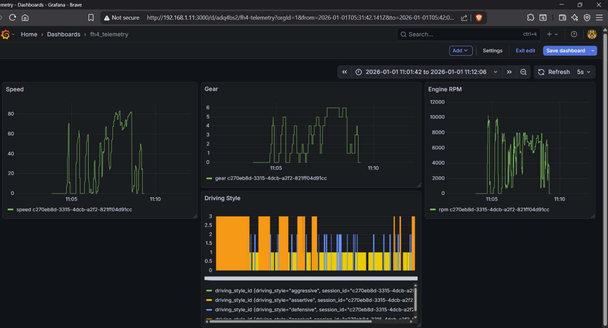
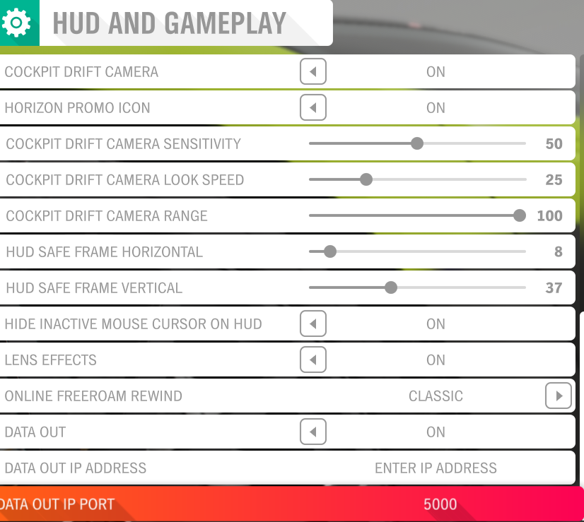

# FH4 Telemetry Analyzer

Realtime telemetry analysis for Forza Horizon 4 using Python, Docker, and ML.

## Features
- Capture live telemetry from FH4
- Predict driving style using ML
- Visualize data in Grafana

## Grafana Dashboard

## FH4 Settings

## Setup
1. Clone the repo
2. Install requirements
3. Run with Docker
